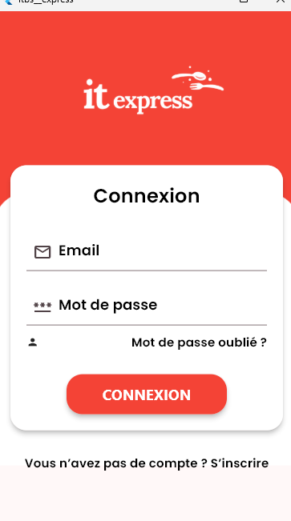
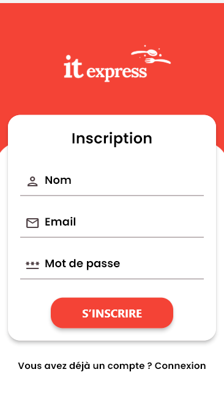
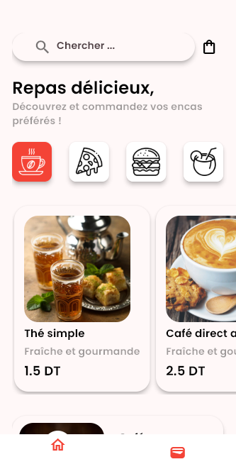
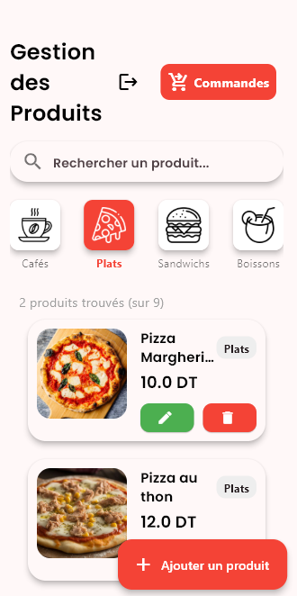
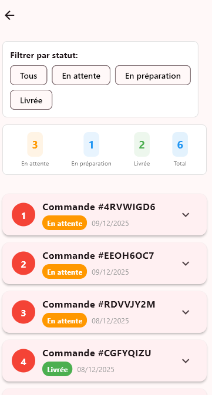
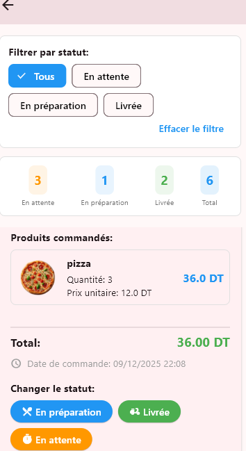
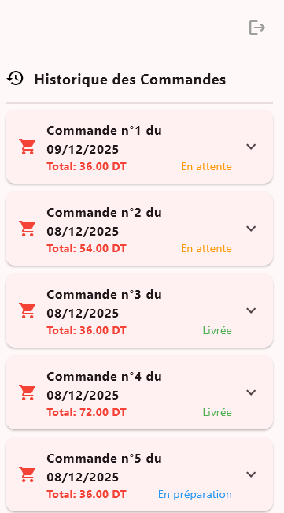
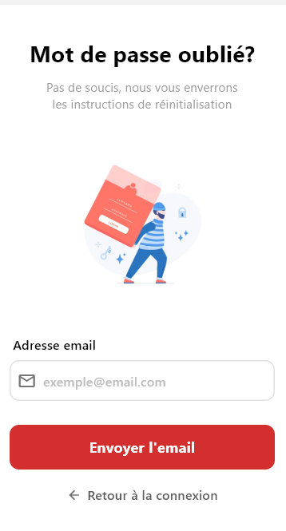

<div align="center">


# 🍕 IT Express

### Application mobile de commande de repas rapide

[](https://flutter.dev)
[](https://dart.dev)
[](https://firebase.google.com)
[](https://cloudinary.com)
[](https://developer.android.com/studio)

*Choisis ce que tu veux et prépare-toi à te régaler en un clin d'œil !*

</div>

---

## 📱 Aperçu

**IT Express** est une application mobile de commande de fast-food développée avec Flutter. Elle propose une expérience fluide et rapide pour les utilisateurs souhaitant commander leurs repas favoris, ainsi qu'un **espace admin complet** pour gérer les produits et les commandes.

---

## ✨ Fonctionnalités

### 👤 Côté Utilisateur
- **Onboarding** — Écrans d'introduction animés pour découvrir l'application
- **Authentification** — Inscription, connexion et réinitialisation du mot de passe par email
- **Catalogue produits** — Navigation par catégories : Cafés, Plats, Sandwichs, Boissons
- **Recherche** — Recherche rapide de produits par nom
- **Panier & Commandes** — Ajout au panier et passage de commandes
- **Historique des commandes** — Suivi de toutes les commandes passées avec statut en temps réel

### 🛠️ Côté Admin (Espace Admin)
- **Connexion sécurisée** — Interface d'authentification dédiée aux administrateurs
- **Gestion des produits** — Ajout, modification et suppression des produits
- **Gestion des commandes** — Visualisation et filtrage des commandes par statut
- **Changement de statut** — Mise à jour du statut des commandes : En attente → En préparation → Livrée
- **Tableau de bord** — Compteurs visuels par statut (En attente, En préparation, Livrée, Total)

---

## 📸 Captures d'écran

<div align="center">

| Onboarding | Connexion | Inscription |
|:-----------:|:---------:|:-----------:|
|  |  |  |

| Accueil | Gestion Produits | Commandes Admin |
|:-------:|:----------------:|:---------------:|
|  |  |  |

| Détail Commande | Historique | Mot de passe oublié |
|:---------------:|:----------:|:-------------------:|
|  |  |  |

</div>

---

## 🏗️ Architecture & Technologies

| Technologie | Usage |
|-------------|-------|
| **Flutter / Dart** | Framework mobile cross-platform |
| **Firebase Auth** | Authentification utilisateurs & admins |
| **Cloud Firestore** | Base de données en temps réel (produits, commandes) |
| **Cloudinary** | Hébergement et gestion des images produits |
| **Android Studio** | IDE de développement |

---

## 🚀 Installation & Lancement

### Prérequis
- [Flutter SDK](https://docs.flutter.dev/get-started/install) ≥ 3.0
- [Android Studio](https://developer.android.com/studio) ou VS Code
- Un compte [Firebase](https://firebase.google.com) configuré
- Un compte [Cloudinary](https://cloudinary.com) configuré

### Étapes

```bash
# 1. Cloner le dépôt
git clone https://github.com/votre-username/it-express.git
cd it-express

# 2. Installer les dépendances
flutter pub get

# 3. Configurer Firebase
# - Créer un projet Firebase
# - Télécharger google-services.json et le placer dans android/app/
# - Activer Authentication (Email/Password) et Firestore

# 4. Configurer Cloudinary
# - Ajouter vos credentials Cloudinary dans le fichier de configuration

# 5. Lancer l'application
flutter run
```

---

## 🗂️ Structure du projet

```
lib/
├── main.dart
├── screens/
│   ├── onboarding/
│   ├── auth/
│   │   ├── login_screen.dart
│   │   ├── register_screen.dart
│   │   └── forgot_password_screen.dart
│   ├── user/
│   │   ├── home_screen.dart
│   │   ├── cart_screen.dart
│   │   └── order_history_screen.dart
│   └── admin/
│       ├── admin_login_screen.dart
│       ├── product_management_screen.dart
│       └── order_management_screen.dart
├── models/
│   ├── product.dart
│   └── order.dart
├── services/
│   ├── auth_service.dart
│   ├── firestore_service.dart
│   └── cloudinary_service.dart
└── widgets/
    ├── product_card.dart
    └── order_card.dart
```

---

## 🔐 Rôles & Accès

| Rôle | Accès |
|------|-------|
| **Utilisateur** | Parcourir le menu, passer des commandes, voir l'historique |
| **Admin** | Gérer les produits, suivre et mettre à jour toutes les commandes |

---

## 📦 Statuts des commandes

```
🟠 En attente  →  🔵 En préparation  →  🟢 Livrée
```

---

## 🤝 Contribution

Les contributions sont les bienvenues !

1. Fork le projet
2. Crée ta branche (`git checkout -b feature/nouvelle-fonctionnalite`)
3. Commit tes changements (`git commit -m 'Ajout nouvelle fonctionnalité'`)
4. Push sur la branche (`git push origin feature/nouvelle-fonctionnalite`)
5. Ouvre une Pull Request

---

## 📄 Licence

Ce projet est sous licence MIT. Voir le fichier [LICENSE](LICENSE) pour plus de détails.

---

<div align="center">

Développé avec ❤️ en Flutter

**IT Express** — *Repas délicieux, en un clin d'œil !* 🍽️

</div>
